# ReproAI

**Turn real mobile failures into reproducible tests — and verify the fix using the same scenario.**

ReproAI is an Android-first debugging tool that captures device and instrumented application events, reconstructs a failure sequence, and generates a typed, machine-executable `TestScenario`. A laptop-side runner executes it through ADB; after a fix, the same scenario is rerun and both outcomes become a developer report.

**Validated:** two independent failure classes on a physical Android phone · 62 backend tests passed · 40 Android unit tests passed · 35 phone UI instrumentation tests passed.

### Live Demo

[Prototype](https://repro-ai-mu.vercel.app/) · [Demo Video](https://youtube.com/shorts/72w0FL3EjJw?feature=share) · [Demo Release](https://github.com/pranaykhodade1922-dot/ReproAI/releases/tag/v1.0.0-demo)

**Capture → Diagnose → Reproduce → Verify → Report**

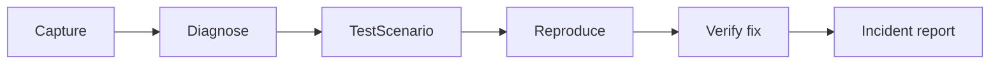

## The Problem

Mobile failures depend on user actions, network state, lifecycle transitions, orientation, app state, API responses and timing. A screenshot, log excerpt or “Payment failed” report rarely preserves the exact sequence needed to reproduce the issue.

Developers need an actionable sequence and a way to check whether their fix actually changes the outcome.

## The Solution

ReproAI correlates selected debugging events with the tester’s description, identifies a supported failure pattern, and produces reproduction steps plus a typed scenario. Repro Runner executes those steps on the phone and checks execution-scoped evidence.

**Reproduction and verification reuse the same scenario identity and the same reproduction actions.** Reproduction evaluates failure assertions, while Verify Fix switches to a typed healthy-state assertion profile. A fix is reported as `FIX VERIFIED` only when positive healthy evidence is observed, not merely because the original failure disappeared.

Observed events remain separate from the analyzer’s inferred diagnosis; the validated prototype currently uses deterministic local analysis rules, not LLM inference.

## Demo Example: Payment Retry

Observed in DemoShop’s deterministic payment hook:

```text
PAY tapped → network transition → retry → TOKEN_EXPIRED → HTTP 401 → PAYMENT_FAILED
```

The generated scenario arms the transition before PAY:

```text
REPRODUCE
Actions:
OPEN_SCREEN Checkout
CHANGE_NETWORK CELLULAR
TAP PAY
WAIT 2500 ms

Failure assertions: TOKEN_EXPIRED, HTTP 401, PAYMENT_FAILED
Result: BUG REPRODUCED

VERIFY FIX
Enable fixed authentication; reuse the same scenario identity and reproduction actions.
Typed healthy-state assertions: TOKEN_REFRESHED, HTTP 200, PAYMENT_SUCCESS
Result: FIX VERIFIED
```

`CHANGE_NETWORK` activates DemoShop’s controlled transition; it does not switch the phone’s radios.

## Validated Failure Classes

| Failure class | Trigger | Failure evidence | Fix evidence |
| --- | --- | --- | --- |
| Network/auth retry | DemoShop network-transition hook during payment | `TOKEN_EXPIRED`, HTTP 401, `PAYMENT_FAILED` | `TOKEN_REFRESHED`, HTTP 200, `PAYMENT_SUCCESS` |
| Rotation/state restoration | Actual portrait → landscape rotation with UPI selected in Checkout | `CHECKOUT_STATE_LOST`, `CHECKOUT_INVALID`, `PAYMENT_BLOCKED` | `CHECKOUT_STATE_RESTORED`, `CHECKOUT_VALID`, `PAYMENT_AVAILABLE`; UPI retained |

Both buggy and fixed modes passed their real-device validation journeys. These two instrumented patterns validate multiple failure mechanisms; they do not imply support for every Android bug. [Measured evidence and validation matrix](docs/multi-bug-validation.md).

## Screenshots

Actual phone captures of the payment demo. Images link to full-size versions.

These historical Phase 8 captures predate the current typed healthy-state assertion profile. The latest [Verify Fix validation](docs/verify-fix-validation.md) records 3/3 healthy assertion matches for Bug 1; the older screenshot’s original failure checks are not the current healthy assertion results.

<table>
  <tr>
    <td align="center"><strong>Home</strong><br><a href="docs/screenshots/01-home.png">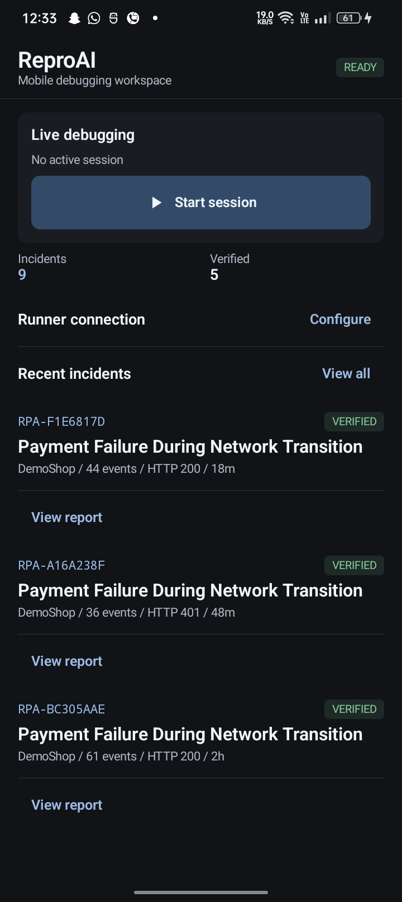</a><br>Saved incidents and readiness</td>
    <td align="center"><strong>Live Session</strong><br><a href="docs/screenshots/02-live-session.png">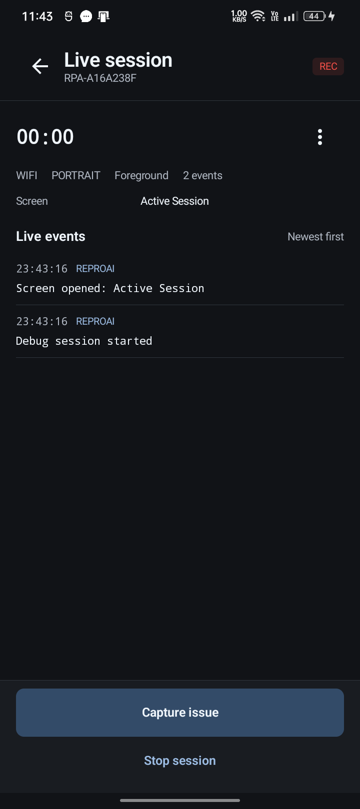</a><br>Capture device and app context</td>
    <td align="center"><strong>Incident Analysis</strong><br><a href="docs/screenshots/03-analysis.png">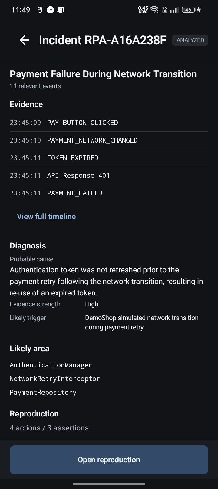</a><br>Evidence and inferred diagnosis</td>
  </tr>
  <tr>
    <td align="center"><strong>Timeline</strong><br><a href="docs/screenshots/04-timeline.png">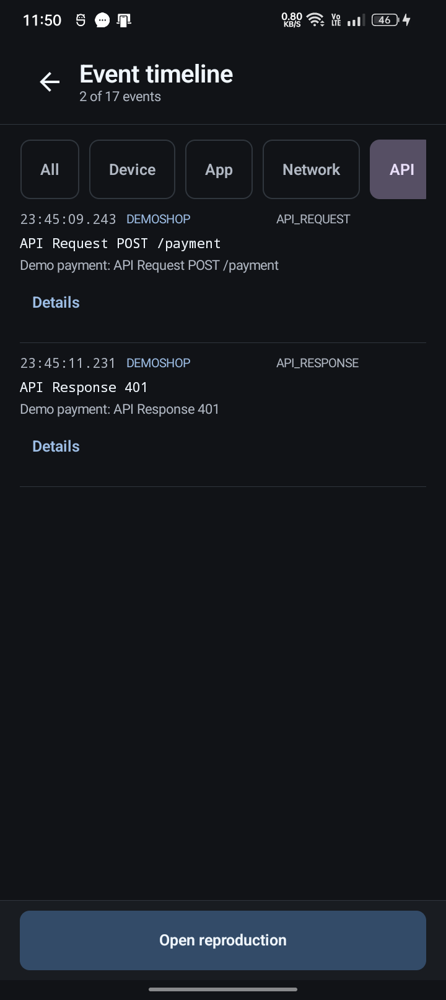</a><br>Inspect the failure sequence</td>
    <td align="center"><strong>Reproduction</strong><br><a href="docs/screenshots/05-reproduction.png">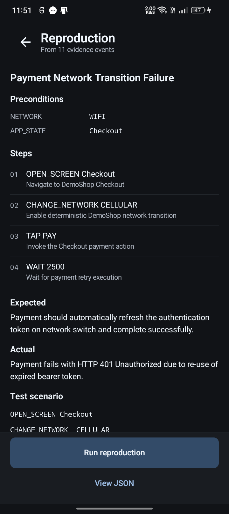</a><br>Review executable steps</td>
    <td align="center"><strong>Running Test</strong><br><a href="docs/screenshots/06-running-test.png">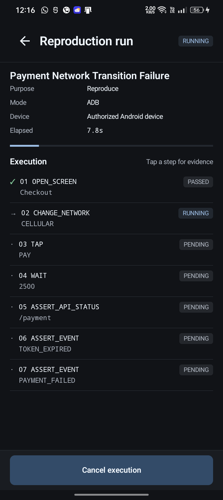</a><br>Follow real ADB progress</td>
  </tr>
  <tr>
    <td align="center"><strong>Bug Reproduced</strong><br><a href="docs/screenshots/07-bug-reproduced.png">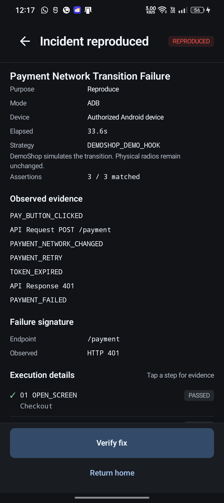</a><br>Confirm measured failure</td>
    <td align="center"><strong>Fix Verified</strong><br><a href="docs/screenshots/08-fix-verified.png">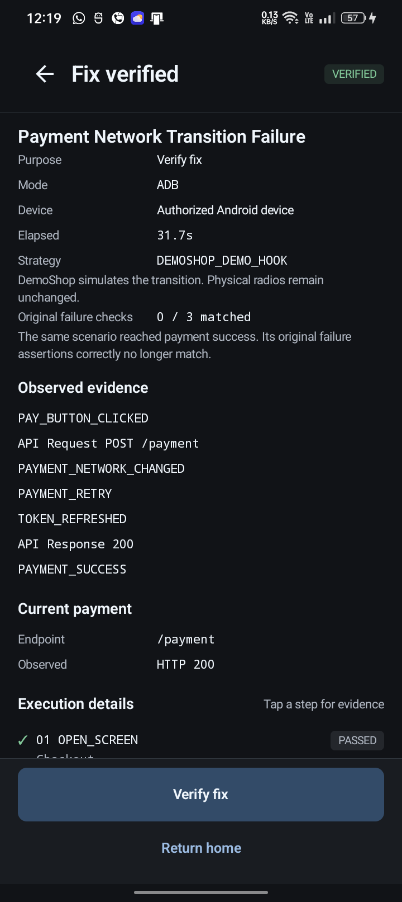</a><br>Verify the same scenario</td>
    <td align="center"><strong>Incident Report</strong><br><a href="docs/screenshots/09-incident-report.png">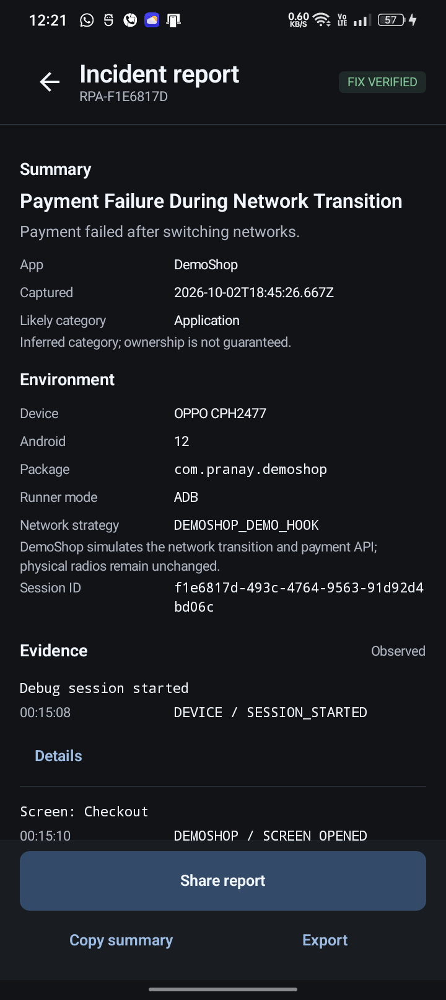</a><br>Retain and export evidence</td>
  </tr>
</table>

[Screenshot provenance](docs/screenshots/README.md).

## How It Works

1. **Capture:** Start a session; record device context and app events emitted through `repro-sdk`.
2. **Analyze:** Combine the description with captured evidence. Local analysis rules identify supported patterns and present a likely cause.
3. **Generate TestScenario:** Produce typed actions, preconditions and assertions that the developer can inspect.
4. **Execute:** Send the scenario to FastAPI; ADB drives DemoShop and WebSocket updates show progress. Unsupported actions cannot count as proof.
5. **Verify & Report:** After the app is fixed, rerun the same scenario identity and reproduction actions using the healthy verification profile. Require positive healthy-state evidence, then preserve both the original reproduction and fix-verification results in reports and sanitized exports.

## Architecture

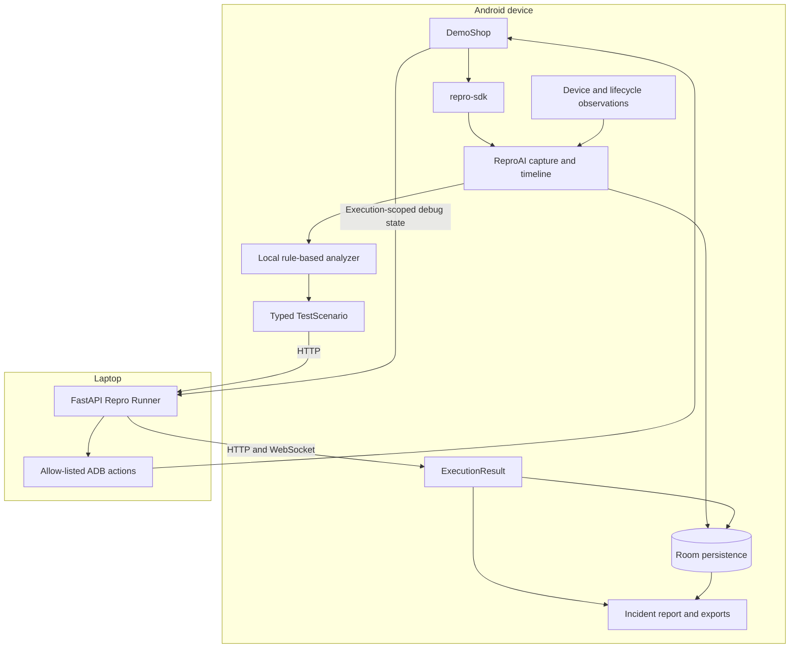

### Project Structure

```text
ReproAI/
├── android-app/
│   ├── app/          # ReproAI capture, analysis, UI, persistence and reports
│   ├── repro-sdk/    # Instrumented app event library
│   ├── demo-shop/    # Demo target with independent buggy/fixed controls
│   └── gradle/       # Version catalog and wrapper
├── backend/
│   ├── app/          # API, ADB driver, runner and preflight
│   ├── tests/
│   ├── samples/
│   └── docs/
├── docs/             # Validation, presenter guides and screenshots
├── tools/            # Development phone UI helper
└── walkthrough.md    # Implementation and validation history
```

Build the `app` module; the older `android-app/src/` tree is retained history, not the active app module.

## Tech Stack

| Area | Implementation |
| --- | --- |
| Android | Kotlin, Jetpack Compose, Room, Coroutines, StateFlow, Retrofit/OkHttp |
| SDK | Android library with explicit package-restricted broadcasts |
| Analysis | Typed models, provider abstraction and deterministic local rules |
| Backend | Python 3.12, FastAPI, Pydantic v2, HTTP and WebSocket |
| Automation | ADB, allow-listed debug hooks, measured display rotation |
| Testing | pytest, JUnit unit tests, on-device Compose/UI instrumentation |

## What Is Real vs Deterministic

| Scope | Current behavior |
| --- | --- |
| Real device execution | Physical Android phone, ADB actions, display rotation and Activity recreation |
| Real application pipeline | Event capture, runner communication, scoped assertions, Room persistence, reports and exports |
| Deterministic demo behavior | DemoShop’s network/auth/payment state machine and deliberately buggy/fixed implementations; fixed checkout restores UPI from saved instance state |
| Mock mode | Simulates execution for transport/UI checks; proves neither reproduction nor a fix |
| Not implemented or validated | Physical Wi-Fi → cellular automation, production payment gateway validation, actual iQOO hardware validation |

## Running ReproAI

Prerequisites: Python 3.12, Android Studio with its bundled JDK and Android SDK/platform-tools, and an authorized Android phone for ADB mode.

### Android

Open `android-app/` in Android Studio and configure the SDK, or run from the repository root with a compatible JDK configured:

```powershell
cd android-app
.\gradlew.bat :app:assembleDebug :demo-shop:assembleDebug
adb devices
adb -s '<authorized serial>' install -r app/build/outputs/apk/debug/app-debug.apk
adb -s '<authorized serial>' install -r demo-shop/build/outputs/apk/debug/demo-shop-debug.apk
```

Use both debug APKs: LAN HTTP and DemoShop automation are debug-only. SDK location belongs in your local, ignored `local.properties`.

### Backend

From the repository root:

```powershell
cd backend
python -m venv .venv
.\.venv\Scripts\python.exe -m pip install -r requirements.txt
if (!(Test-Path .env)) { Copy-Item .env.example .env }
```

For a local mock runner:

```powershell
$env:RUNNER_MODE='mock'
$env:HOST='127.0.0.1'
.\.venv\Scripts\python.exe main.py
```

For real device execution on a trusted LAN, stop the mock runner first:

```powershell
$env:RUNNER_MODE='adb'
$env:HOST='0.0.0.0'
$env:DEFAULT_DEVICE_SERIAL='<exact authorized serial from adb devices>'
$env:NETWORK_STRATEGY='DETERMINISTIC_DEMO'
$env:ENABLE_DEMO_CONTROLS='true'
.\.venv\Scripts\python.exe main.py
```

On ReproAI Home, **Configure** the laptop’s LAN IPv4 host and port `8000`, then **Test connection → Check readiness**. Both devices must share the trusted LAN. For USB-only access, use `adb -s '<serial>' reverse tcp:8000 tcp:8000` and configure the phone with `127.0.0.1`; the runner can stay on localhost. ADB mode never silently falls back to mock.

### Environment Configuration

Start from [backend/.env.example](backend/.env.example); preserve your existing `.env` and keep it private.

| Setting | Purpose / safe default |
| --- | --- |
| `HOST`, `PORT` | Runner bind address and port; `127.0.0.1`, `8000` |
| `RUNNER_MODE` | `mock` by default; choose `adb` for device execution |
| `ADB_PATH` | Platform-tools executable; defaults to `adb` on PATH |
| `DEFAULT_DEVICE_SERIAL` | Exact authorized online device; blank by default |
| `NETWORK_STRATEGY` | `DETERMINISTIC_DEMO`; physical `REAL_NETWORK` is unsupported |
| `ENABLE_DEMO_CONTROLS` | Debug reset endpoint; `false` by default |

## Demo Flow

**Start session → trigger DemoShop failure → Capture issue → Analyze → generated reproduction → Run → BUG REPRODUCED → enable fix → Verify Fix → FIX VERIFIED → report/export.**

The full live/manual demo flow typically takes 3–5 minutes. A shortened walkthrough video is linked above. Before starting, use **Configure → Developer demo → Check readiness → Reset demo**; capture promptly after failure. Reset clears temporary demo state and both fix switches while preserving incident history. [Presenter script and recovery steps](docs/demo-script.md).

## Developer Reports

Reports retain the observed timeline, inferred diagnosis, scenario, environment and separate original/verification results. Export sanitized **JSON, Markdown, text or a developer ZIP**, copy a summary, or use the Android Share Sheet. Completed reports restore from Room after restart.

The ZIP includes the plain `TestScenario` and available execution results for the laptop workflow. [Report design](docs/phase7-reports.md) · [Export and Office Kit workflow; hardware transfer validation pending](docs/office-kit-workflow.md).

## Privacy & Security

Selected events and exports redact tokens/credentials, emails and phone numbers. SDK IPC targets the ReproAI package; sharing uses app-private files and scoped FileProvider read grants. Runner actions and packages are allow-listed; subprocesses use `shell=False`, and scenario JSON cannot request arbitrary shell execution. DemoShop automation components are excluded from the release manifest.

These are development protections, not a complete production security model. The runner is unauthenticated, SDK broadcasts are not authenticated, and raw local debugging data can remain sensitive. Use localhost or a trusted demo LAN and review exports before sharing. Secrets, machine configuration, builds and runtime dumps are excluded from Git.

## Validation

| Check | Verified result |
| --- | --- |
| Backend pytest | **62 passed** |
| Android unit tests | **40 passed** |
| Phone UI instrumentation | **35 passed** |
| Checkout layout tests | **6 passed** (tested across 360, 393, 430 dp viewports and 1.0x/1.3x font scales) |
| Bug 1 reproduction | **BUG REPRODUCED** — 3/3 failure assertions passed |
| Bug 1 fix verification | **FIX VERIFIED** — same scenario identity/actions, 3/3 healthy assertions passed (`TOKEN_REFRESHED`, HTTP 200, `PAYMENT_SUCCESS`) |
| Bug 2 reproduction & verification | **Previously validated** — 5/5 failure assertions matched, 5/5 healthy assertions verified with unchanged scenario |
| ReproAI / DemoShop debug APKs | **Both builds successful** |
| Real-device journeys | **Both bug classes reproduced and fixes verified with unchanged scenarios** |
| Persistence | Both reports survived restart; 13 local incidents preserved |

Fresh Bug 1 validation on **OPPO CPH2577, Android 15**; historical validation on **OPPO CPH2477, Android 12** retained. Actual iQOO validation remains pending. [Detailed two-bug evidence](docs/multi-bug-validation.md).

```powershell
cd backend
.\.venv\Scripts\python.exe -m pytest
cd ../android-app
.\gradlew.bat :app:testDebugUnitTest :app:assembleDebug :demo-shop:assembleDebug
```

## Known Limitations

- Physical Wi-Fi/cellular switching is not automated; DemoShop supplies deterministic network failure hooks and a fake payment service.
- Production payment systems, arbitrary-app reproduction and LLM inference are not integrated. Current validation covers two instrumented failure classes.
- Rotation support depends on device controls; this OPPO requires window-manager rotation. Unsupported or unmeasured execution cannot verify a fix.
- Backend execution history is in memory; Android incident/report history persists. Wireless debugging may disconnect when the phone sleeps.
- Actual iQOO hardware and compatible Office Kit transfer validation remain pending.

## Documentation

[Multi-bug validation](docs/multi-bug-validation.md) · [Demo script](docs/demo-script.md) · [Phase 8 hardening](docs/phase8-hardening.md) · [UI redesign](docs/ui-redesign.md) · [Backend setup](backend/README.md) · [API contract](backend/docs/api-contract.md) · [DemoShop automation](backend/docs/demoshop-automation.md) · [Submission checklist](docs/submission-checklist.md) · [iQOO validation checklist](docs/iqoo-validation-checklist.md) · [Walkthrough](walkthrough.md).

## Why ReproAI

Crash logs describe a failure. ReproAI focuses on reconstructing the sequence around it and converting supported patterns into a reusable executable scenario. That same scenario becomes a regression check after the fix.

## Future Work

GitHub/Jira incident integration, broader SDK/target support, additional failure classes, on-device model optimization and team/cloud workspaces. These are roadmap items, not current functionality.

---

Built for the **iQOO Developer Tools challenge**.

[Live prototype, demo video and demo release](#live-demo).
