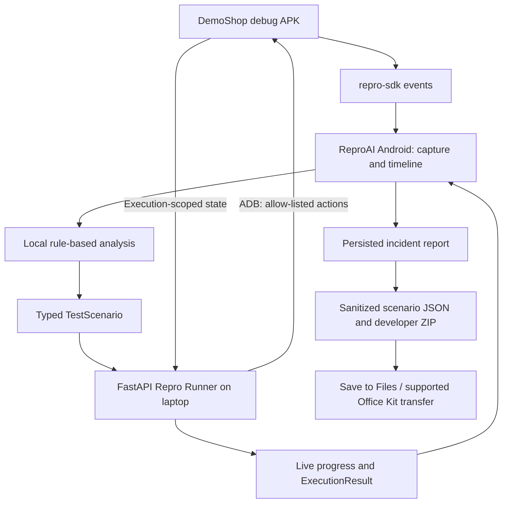

# ReproAI

**Turn real mobile failures into reproducible tests.**

Developers see a mobile failure but often cannot recreate its conditions. ReproAI captures device and instrumented app events, explains the evidence, generates a typed test scenario, and sends it to a laptop runner. ADB executes the scenario on the phone; the report retains the original failure and same-scenario fix verification.

The working demo reproduces DemoShop's authentication retry failure: **TOKEN_EXPIRED → HTTP 401 → PAYMENT_FAILED**. Enable fixed authentication, rerun the same scenario, and verify **TOKEN_REFRESHED → HTTP 200 → PAYMENT_SUCCESS**. Network transitions and payments use explicitly labeled DemoShop test hooks.

ReproAI has also been validated against an independent Android configuration/state-restoration failure: select UPI, rotate the actual device, and observe **CHECKOUT_STATE_LOST → CHECKOUT_INVALID → PAYMENT_BLOCKED**. The separate checkout rotation fix restores the selection from saved instance state; the same scenario then verifies **CHECKOUT_STATE_RESTORED → CHECKOUT_VALID → PAYMENT_AVAILABLE**. These two instrumented failure classes share the existing pipeline and separate incident reports. This does not imply support for every Android bug. [Architecture, device evidence and validation matrix](docs/multi-bug-validation.md).

## How it works



**Stack:** Kotlin, Jetpack Compose, Room, Retrofit/OkHttp, Python, FastAPI, Pydantic and ADB. Analysis currently uses local rules; no local/open-source LLM inference or cloud dependency is active.

## Live demo

Start session → DemoShop buggy payment → Capture issue → “Payment failed after switching networks.” → Analyze → Run reproduction → BUG REPRODUCED → enable FIXED → Verify Fix → FIX VERIFIED → export developer package.

Allow 3–5 minutes. Before presenting, use **Configure → Developer demo → Check readiness → Reset demo**. Capture within 30 seconds of the failure. [Presenter script and compressed video script](docs/demo-script.md).

## Screenshots

| Analysis | Reproduced | Verified |
|---|---|---|
|  |  |  |

[All nine phone screenshots](docs/screenshots/README.md).

## How to run

Use Python 3.12, Android SDK platform-tools, Android Studio's JDK, and an authorized Android phone. Build from `android-app/`; the older `android-app/src/` tree is not the app module.

### Android setup

```powershell
cd android-app
$env:JAVA_HOME='C:\Program Files\Android\Android Studio\jbr'
.\gradlew.bat :app:assembleDebug :demo-shop:assembleDebug
adb devices
adb -s '<authorized serial>' install -r app/build/outputs/apk/debug/app-debug.apk
adb -s '<authorized serial>' install -r demo-shop/build/outputs/apk/debug/demo-shop-debug.apk
```

Use debug APKs for the live demo: HTTP and finite DemoShop automation hooks are debug-only. Release APKs build unsigned and exclude those hooks; they are not substitutes for the demo APKs.

### Backend setup

```powershell
cd backend
python -m venv .venv
.\.venv\Scripts\python.exe -m pip install -r requirements.txt
Copy-Item .env.example .env  # First setup only; preserve an existing .env.
$env:RUNNER_MODE='adb'
$env:DEFAULT_DEVICE_SERIAL='<exact authorized online serial>'
$env:NETWORK_STRATEGY='DETERMINISTIC_DEMO'
$env:ENABLE_DEMO_CONTROLS='true'
$env:HOST='0.0.0.0'
.\.venv\Scripts\python.exe main.py
```

On ReproAI Home, Configure the laptop's current Wi-Fi IPv4 host and port `8000`, then Test connection and Check readiness. Both devices must share a trusted LAN. Wireless debugging ports can change; reconnect ADB and update the selected serial. No OPPO/iQOO address is hardcoded.

For USB debugging, keep the runner on localhost and use `adb -s '<serial>' reverse tcp:8000 tcp:8000`; configure the phone with host `127.0.0.1`, port `8000`. Remove the mapping afterward. For LAN use, allow Python only on Windows Firewall's Private profile; keep the firewall enabled.

### Mock vs ADB

The default backend mode is `mock`. Mock runs test transport and persistence, require explicit confirmation, and prove neither reproduction nor a fix. ADB mode controls the actual DemoShop APK and requires measured, execution-scoped evidence. It never falls back to mock. The strategy is **DEMOSHOP_DEMO_HOOK**, not physical radio switching.

### Export and Office Kit

Report → Export developer package → Save to Files creates a sanitized ZIP containing reports, the plain TestScenario, and available original/verification results. Transfer the saved file using the supported Office Kit file workflow on compatible hardware. [Workflow, compatibility and CLI instructions](docs/office-kit-workflow.md). No undocumented Office Kit API or assumed Share Sheet target is used.

```powershell
cd backend
.\.venv\Scripts\python.exe -m app.cli validate path/to/test-scenario.json
.\.venv\Scripts\python.exe -m app.cli run path/to/test-scenario.json
```

CLI execution uses the existing runner API and preflight. Mock requires `--allow-mock`.

## Validation and recovery

```powershell
cd backend
.\.venv\Scripts\python.exe -m pytest
cd ../android-app
.\gradlew.bat :app:testDebugUnitTest :app:assembleDebug :demo-shop:assembleDebug
```

Errors offer Retry, Reconnect runner and debug Reset demo. Reset restores BUGGY mode and clears temporary demo state while preserving incidents. Completed reports restore from Room; stale running state is not presented as active. [Final validation matrix, timeouts and security review](docs/phase8-hardening.md), [API contract](backend/docs/api-contract.md), [report design](docs/phase7-reports.md).

## Security and privacy

Reports, scenario exports and ZIPs recursively redact credentials and common personal data. Files are app-private, shared through a narrowly scoped, non-exported FileProvider with temporary read permission. ADB uses controlled package/action lists and `shell=False`; imported JSON is validated, never executed as code. `.env`, raw artifacts, keys and builds are ignored by repository ignore rules.

The development runner is unauthenticated: keep it on localhost or a trusted demo LAN. Raw captured events remain sensitive local debugging data. SDK broadcasts are not authenticated and cannot be treated as production-trusted telemetry. Automated redaction cannot guarantee removal of every secret format; review exports before sharing.

## Known limitations and hackathon notes

Physical Wi-Fi/cellular automation, production payment verification, arbitrary-app reproduction and LLM inference are not implemented. Backend execution history is in memory; Android incident/report history persists. Cancellation is cooperative. Current hardware validation uses an OPPO phone; actual iQOO and Office Kit pairing/transfer require the final compatible equipment.

[iQOO validation checklist](docs/iqoo-validation-checklist.md) · [Submission checklist](docs/submission-checklist.md) · [Walkthrough](walkthrough.md). The team must provide its repository, prototype and video URLs and record a backup demo.

Future work: production authentication/telemetry trust, broader target adapters, genuine LLM inference and physical radio controls. These are outside this hardening phase.
